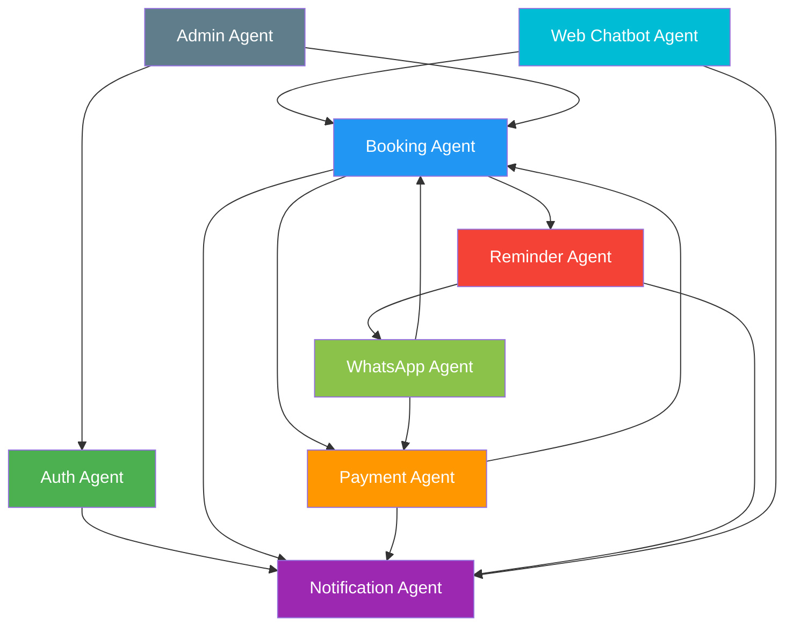
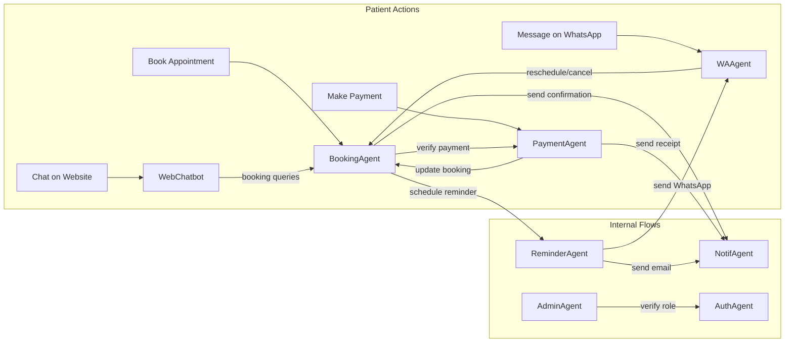

# Software Agents & Components Description
## SmileCare — System Architecture
> **Document Version:** 2.0  
> **Last Updated:** 2026-02-22  
> **Related Docs:** [PRD](./01-PRD.md) · [SOP](./02-SOP.md) · [Workflows](./04-Workflows.md) · [Feature Logic](./05-Feature-Logic.md)
---
## Overview
The SmileCare platform is composed of **8 modular backend agents** (microservices) that each own a specific domain. They communicate via RESTful APIs and a shared PostgreSQL database. The frontend layer (website, patient portal, admin dashboard, chatbot UI) calls these agents through a unified API gateway.
### Design Principles
| Principle | Implementation |
|-----------|---------------|
| **Single Responsibility** | Each agent owns exactly one domain (auth, booking, payment, etc.) |
| **Loose Coupling** | Agents communicate via APIs, not direct DB queries across domains |
| **Shared Database** | PostgreSQL (via Prisma ORM) — agents own their tables but can read shared references |
| **Fail Gracefully** | Every agent handles errors and returns meaningful HTTP status codes |
| **Audit Everything** | All mutations are logged with timestamps and actor IDs |
---
## System Architecture Diagram
```
┌──────────────────────────────────────────────────────────────────────┐
│                          FRONTEND LAYER                              │
│  ┌────────────┐ ┌────────────┐ ┌────────────┐ ┌─────────────────┐  │
│  │  Website   │ │  Patient   │ │   Admin    │ │ Website Chatbot │  │
│  │   Pages    │ │   Portal   │ │ Dashboard  │ │  (Text+Voice)   │  │
│  └─────┬──────┘ └─────┬──────┘ └─────┬──────┘ └───────┬─────────┘  │
│        │               │              │                 │            │
├────────┼───────────────┼──────────────┼─────────────────┼────────────┤
│        │          API GATEWAY (Express.js)              │            │
│  ┌─────▼───────────────▼──────────────▼─────────────────▼──────────┐│
│  │                    Node.js Backend Server                       ││
│  │  ┌───────────┐ ┌────────────┐ ┌────────────┐ ┌──────────────┐  ││
│  │  │  Auth     │ │  Booking   │ │  Payment   │ │ Notification │  ││
│  │  │  Agent    │ │  Agent     │ │  Agent     │ │    Agent     │  ││
│  │  └───────────┘ └────────────┘ └────────────┘ └──────────────┘  ││
│  │  ┌───────────┐ ┌────────────┐ ┌────────────┐ ┌──────────────┐  ││
│  │  │ Web Chat  │ │ WhatsApp   │ │  Reminder  │ │    Admin     │  ││
│  │  │  Agent    │ │   Agent    │ │   Agent    │ │    Agent     │  ││
│  │  └───────────┘ └────────────┘ └────────────┘ └──────────────┘  ││
│  └─────────────────────────┬───────────────────────────────────────┘│
│                            │                                        │
├────────────────────────────┼────────────────────────────────────────┤
│                       DATA LAYER                                    │
│  ┌────────────┐  ┌─────────┼────┐  ┌─────────────────┐             │
│  │ PostgreSQL │  │ Redis Cache  │  │  File Storage   │             │
│  │  (Prisma)  │  │ (Sessions)   │  │  (Cloudinary)   │             │
│  └────────────┘  └──────────────┘  └─────────────────┘             │
└─────────────────────────────────────────────────────────────────────┘
         EXTERNAL SERVICES
  ┌────────────┐ ┌────────────┐ ┌────────────┐ ┌────────────┐
  │  Razorpay  │ │ Meta Cloud │ │ ElevenLabs │ │   SMTP     │
  │  Gateway   │ │    API     │ │    TTS     │ │ (Email)    │
  └────────────┘ └────────────┘ └────────────┘ └────────────┘
```
### Agent Dependency Map

---
## Agent 1: Authentication Agent (`auth-agent`)
**Purpose:** Manages user registration, login, session lifecycle, role-based access control, and password recovery.  
**Owner Tables:** `users`, `sessions`
### API Endpoints
| Method | Endpoint | Purpose | Auth Required |
|--------|----------|---------|---------------|
| `POST` | `/api/auth/register` | Create new user (patient/admin) | Public |
| `POST` | `/api/auth/login` | Verify credentials, return JWT tokens | Public |
| `POST` | `/api/auth/logout` | Invalidate current session | JWT |
| `POST` | `/api/auth/refresh` | Issue new access token from refresh token | Refresh Token |
| `GET`  | `/api/auth/me` | Get current authenticated user profile | JWT |
| `POST` | `/api/auth/forgot-password` | Send OTP to registered email | Public |
| `POST` | `/api/auth/reset-password` | Verify OTP and set new password | Public |
### I/O Contract
```
INPUTS:
  Register → { name, email, password, phone, role? }
  Login    → { email, password }
  Refresh  → { refreshToken (httpOnly cookie) }
OUTPUTS:
  Register → { user: { id, name, email, role }, accessToken, refreshToken }
  Login    → { user: { id, name, email, role }, accessToken, refreshToken }
  Me       → { id, name, email, phone, role, createdAt }
```
### Security Configuration
| Parameter | Value | Rationale |
|-----------|-------|-----------|
| Password hashing | bcrypt, **12 salt rounds** | Industry standard, future-proof |
| Access token expiry | **15 minutes** | Short-lived to limit exposure |
| Refresh token expiry | **7 days** | Balances security with UX |
| Login rate limit | **5 attempts / 15 min / IP** | Prevents brute force attacks |
| OTP for password reset | **6-digit numeric, 10 min expiry** | Sent via Notification Agent |
| Token storage | Access: memory (React state); Refresh: `httpOnly` cookie | Prevents XSS token theft |
### Role-Based Access Control (RBAC)
| Role | Access Level |
|------|-------------|
| `patient` | Own profile, own bookings, booking page, patient portal |
| `receptionist` | Patient list, all bookings, notifications, slot management (no settings) |
| `dentist` | Own schedule, assigned patient details (read-only) |
| `admin` | Full access — all features, user management, analytics, settings |
### Error Handling
| Error | HTTP Code | Response |
|-------|-----------|----------|
| Duplicate email | `409` | `{ error: "Email already registered" }` |
| Invalid credentials | `401` | `{ error: "Invalid email or password" }` |
| Rate limited | `429` | `{ error: "Too many login attempts. Try again in X minutes" }` |
| Expired token | `401` | `{ error: "Token expired" }` — triggers client-side refresh |
| Invalid OTP | `400` | `{ error: "Invalid or expired OTP" }` |
### Dependencies
- **Notification Agent** → password reset OTP emails
- **Database** → PostgreSQL via Prisma
---
## Agent 2: Booking Agent (`booking-agent`)
**Purpose:** Manages the full appointment lifecycle — creation, rescheduling, cancellation, and real-time slot availability.  
**Owner Tables:** `bookings`, `slots`, `dentists`, `treatments`  
**Related:** [WF-01](./04-Workflows.md), [WF-02](./04-Workflows.md), [WF-03](./04-Workflows.md), [FL-04](./05-Feature-Logic.md)
### API Endpoints
| Method | Endpoint | Purpose | Auth |
|--------|----------|---------|------|
| `POST` | `/api/bookings` | Create new booking (pending payment) | Public |
| `GET` | `/api/bookings/:id` | Get booking details | JWT |
| `GET` | `/api/bookings/my` | Patient's own bookings | JWT (patient) |
| `PUT` | `/api/bookings/:id/reschedule` | Reschedule (release old slot, reserve new) | JWT |
| `DELETE` | `/api/bookings/:id` | Cancel booking | JWT |
| `GET` | `/api/slots` | Available slots (`?dentist=&date=`) | Public |
| `POST` | `/api/slots/:id/hold` | Temporary 5-min slot hold | Public |
### Booking Status State Machine
```
                    ┌──────────────┐
                    │ pending_     │
         ┌────────▶│ payment      │◀──── Created (POST /api/bookings)
         │         └──────┬───────┘
         │                │ Payment verified
    Slot expired /        ▼
    Payment failed  ┌──────────────┐     Reschedule
         │         │  confirmed   │◀──────┐
         │         └──┬────┬──────┘       │
         │            │    │              │
         ▼            │    │         ┌────┴────────┐
    ┌──────────┐      │    │         │ rescheduled │
    │ expired  │      │    │         └─────────────┘
    └──────────┘      │    │
                      │    ▼
                      │  ┌──────────────┐
                      │  │  cancelled   │──▶ refund_pending ──▶ refunded
                      │  └──────────────┘
                      ▼
              ┌──────────────┐     ┌──────────────┐
              │  completed   │     │   no_show    │
              └──────────────┘     └──────────────┘
```
### Business Rules
| Rule | Policy |
|------|--------|
| Slot duration | Default **30 minutes** (configurable per treatment) |
| Slot hold | **5-minute** temporary reservation during checkout |
| Double-booking prevention | Database-level `UNIQUE` constraint on `(slot_id, status='confirmed')` |
| Reschedule limit | Max **2 reschedules** per booking |
| Reschedule window | Up to **2 hours** before appointment |
| Cancellation refund | ≥ 24h before → full refund; < 24h → no refund (admin override possible) |
| Stale booking cleanup | Cron every 15 min: cancel `pending_payment` bookings older than 15 min |
### Dependencies
- **Payment Agent** → payment verification, refund initiation
- **Notification Agent** → booking/reschedule/cancel confirmations
- **Reminder Agent** → schedule 24h reminder on confirmation
---
## Agent 3: Payment Agent (`payment-agent`)
**Purpose:** Handles all payment processing, signature verification, and refunds through Razorpay.  
**Owner Tables:** `payments`, `refunds`  
**Related:** [WF-10: Payment Failure Recovery](./04-Workflows.md), [FL-11: Razorpay Integration](./05-Feature-Logic.md)
### API Endpoints
| Method | Endpoint | Purpose | Auth |
|--------|----------|---------|------|
| `POST` | `/api/payments/create-order` | Create Razorpay order (₹50 = 5000 paise) | Public |
| `POST` | `/api/payments/verify` | Verify payment signature post-checkout | Public |
| `POST` | `/api/payments/refund/:bookingId` | Initiate refund for eligible cancellation | JWT (admin/receptionist) |
| `POST` | `/api/webhooks/razorpay` | Razorpay webhook receiver | Webhook signature |
### Payment Flow
```
Frontend                    Payment Agent                  Razorpay
   │                             │                            │
   │── create-order ────────────▶│── Create Order ───────────▶│
   │◀── { orderId, amount } ─────│◀── { order object } ──────│
   │                             │                            │
   │── Open Razorpay Checkout ──────────────────────────────▶│
   │◀── { payment_id, signature } ◀──────────────────────────│
   │                             │                            │
   │── verify { ids + sig } ────▶│                            │
   │                             │── HMAC-SHA256 verify ─────▶│
   │◀── { verified: true } ─────│                            │
   │                             │── Update booking: confirmed│
   │                             │── Trigger notifications ───│
```
### Webhook Events Handled
| Event | Action |
|-------|--------|
| `payment.captured` | Update payment status → `captured`, confirm booking |
| `payment.failed` | Update payment status → `failed`, notify admin |
| `refund.processed` | Update refund status → `processed`, notify patient |
### Security
- **Webhook signature verification** using `razorpay_webhook_secret` (HMAC-SHA256)
- **Never stores** raw card details (PCI compliance — fully handled by Razorpay)
- All transactions logged with timestamps for audit trail
### Dependencies
- **Booking Agent** → update booking status on payment events
- **Notification Agent** → send payment receipts, refund confirmations
---
## Agent 4: Notification Agent (`notification-agent`)
**Purpose:** Centralized messaging hub for email delivery and in-app dashboard notifications.  
**Owner Tables:** `notifications`  
**Related:** [FL-09: Email System](./05-Feature-Logic.md)
> [!NOTE]
> This agent is **internal only** — it exposes no public API endpoints. All other agents invoke it directly via internal function calls.
### Notification Types & Templates
| Type | Channel | Template File | Trigger |
|------|---------|--------------|---------|
| `booking_confirmed` | Email + Dashboard | `booking_confirmed.hbs` | New booking confirmed |
| `booking_rescheduled` | Email + Dashboard | `booking_rescheduled.hbs` | Booking rescheduled |
| `booking_cancelled` | Email + Dashboard | `booking_cancelled.hbs` | Booking cancelled |
| `payment_receipt` | Email | `payment_receipt.hbs` | Payment captured |
| `appointment_reminder` | Email | `appointment_reminder.hbs` | 24h before appointment |
| `password_reset` | Email | `password_reset.hbs` | Password reset requested |
| `new_booking_admin` | Dashboard | — | Alert for admin/receptionist |
| `contact_form` | Email + Dashboard | `contact_auto_reply.hbs` | Contact form submitted |
### Email Features
- **Template engine:** Handlebars (`.hbs`)
- **SMTP provider:** Nodemailer (Gmail or custom SMTP)
- **Calendar invites:** `.ics` file generated and attached to booking confirmation emails
- **Retry policy:** Max **3 retries** with exponential backoff (1s → 5s → 30s)
- **Audit:** All notifications stored in DB with `sent_at`, `status`, `retry_count`
### Dependencies
- Triggered by **all other agents** — this is the shared communication backbone
---
## Agent 5: Website Chatbot Agent (`web-chatbot-agent`)
**Purpose:** AI-powered conversational interface on the website with text and voice I/O.  
**Owner Tables:** `chat_sessions`, `chat_messages`  
**Related:** [WF-05: Website Chatbot Conversation](./04-Workflows.md), [FL-07: Website Chatbot](./05-Feature-Logic.md)
### API Endpoints
| Method | Endpoint | Purpose | Auth |
|--------|----------|---------|------|
| `POST` | `/api/chatbot/message` | Process text message, return bot reply | Public |
| `POST` | `/api/chatbot/voice` | Convert response text → audio (TTS) | Public |
### Intent Classification
| Intent | Trigger Keywords | Bot Action |
|--------|-----------------|------------|
| `greeting` | hi, hello, hey | Welcome message + quick menu buttons |
| `book_appointment` | book, appointment, schedule | Redirect link to /booking |
| `treatment_info` | root canal, implant, whitening, braces | Treatment summary + page link |
| `clinic_hours` | hours, open, time, when | "Mon–Sat, 9 AM – 7 PM" |
| `clinic_location` | where, address, location | Address + Google Maps link |
| `pricing` | cost, price, fee, how much | General info + consultation CTA |
| `contact` | call, phone, email | Return contact details |
| `callback_request` | call me, callback | Collect name + phone → admin notification |
| `fallback` | _(unrecognized)_ | "I'm not sure. Here's what I can help with..." |
### Voice Pipeline
```
User speaks → Web Speech API (STT) → transcript text
  → Intent classification → response text
  → ElevenLabs API (TTS) → audio blob → browser playback
```
### ElevenLabs TTS Config
- **Model:** `eleven_monolingual_v1`
- **Voice settings:** `stability: 0.5`, `similarity_boost: 0.75`
- **Output format:** MP3 audio streamed to client
- **Fallback:** If ElevenLabs quota exhausted → graceful fallback to text-only mode
### Dependencies
- **ElevenLabs API** → TTS audio output
- **Booking Agent** → appointment-related queries
- **Notification Agent** → callback request alerts to admin
---
## Agent 6: WhatsApp Chatbot Agent (`whatsapp-agent`)
**Purpose:** Automated patient communication via WhatsApp Business using Meta Cloud API.  
**Owner Tables:** `whatsapp_sessions`, `whatsapp_messages`  
**Related:** [WF-06: WhatsApp Chatbot Flow](./04-Workflows.md), [FL-10: WhatsApp Integration](./05-Feature-Logic.md)
### API Endpoints
| Method | Endpoint | Purpose | Auth |
|--------|----------|---------|------|
| `GET` | `/api/webhooks/whatsapp` | Meta webhook verification | Verify token |
| `POST` | `/api/webhooks/whatsapp` | Receive incoming messages | Meta signature |
### Message Flows
**Inbound (patient → clinic):**
```
Patient sends WhatsApp message
  → Meta Cloud API webhook → POST /api/webhooks/whatsapp
  → Parse message (sender phone, text, type)
  → Load/create session for phone number
  → Classify intent → generate response
  → Send reply via Meta Send Message API
  → Log to whatsapp_messages
```
**Outbound (system → patient):**
```
Booking confirmed / Reminder due / Cancellation processed
  → WhatsApp Agent receives trigger
  → Load pre-approved template message
  → Fill parameters (patient_name, date, time, etc.)
  → Send via Meta API
  → Log sent message
```
### Handled Intents
| Intent | Trigger | Response |
|--------|---------|----------|
| `book_appointment` | "book", "appointment" | Booking page link |
| `reschedule` | "reschedule", "change date" | Collect booking ID → show slots → confirm |
| `cancel` | "cancel" | Collect booking ID → confirm → process |
| `faq_hours` | "hours", "timings" | Clinic hours |
| `faq_fees` | "charges", "cost" | Fee information |
| `faq_services` | "treatments", "services" | Treatment list |
| `human_handoff` | "speak to someone", "agent" | "Connecting you with our receptionist..." |
### Pre-Approved Template Messages
| Template Name | Used For |
|--------------|----------|
| `appointment_confirmation` | Sent after booking |
| `appointment_reminder` | Sent 24h before appointment |
| `cancellation_confirmation` | Sent after cancellation |
| `reschedule_confirmation` | Sent after rescheduling |
### Required Credentials
- `WHATSAPP_TOKEN` — Meta API bearer token
- `WHATSAPP_PHONE_ID` — Business phone number ID
- `WHATSAPP_VERIFY_TOKEN` — Webhook verification token
### Dependencies
- **Meta Cloud API** → message sending/receiving
- **Booking Agent** → reschedule/cancel operations
- **Payment Agent** → refund on cancellation
---
## Agent 7: Reminder Agent (`reminder-agent`)
**Purpose:** Automated scheduling and dispatch of 24-hour appointment reminders.  
**Owner Tables:** None (reads `bookings`, writes `reminder_sent` flag)  
**Related:** [WF-04: Automated 24-Hour Reminder](./04-Workflows.md)
### Mechanism
- **Scheduler:** `node-cron` job
- **Frequency:** Every hour at `:00` (cron: `0 * * * *`)
### Logic Flow
```
[Cron: every hour at :00]
  │
  ├── Query: SELECT * FROM bookings
  │          WHERE status = 'confirmed'
  │          AND reminder_sent = false
  │          AND appointment_date BETWEEN NOW()+23.5h AND NOW()+24.5h
  │
  ├── For each matching booking:
  │     ├── Email reminder via Notification Agent
  │     │     Subject: "Reminder: Your appointment is tomorrow"
  │     │     Body: date, time, dentist, clinic address, directions
  │     │
  │     ├── WhatsApp reminder via WhatsApp Agent
  │     │     Template: appointment_reminder
  │     │     Params: patient_name, date, time, dentist_name
  │     │
  │     └── UPDATE bookings SET reminder_sent = true
  │
  └── Log: "Processed X reminders at [timestamp]"
```
### Error Handling
| Failure | Action |
|---------|--------|
| Email send fails | Retry up to 3× with exponential backoff (1s, 5s, 30s) |
| WhatsApp send fails | Log error, do **not** retry (Meta API rate limits) |
| Both channels fail | Create admin dashboard notification for manual follow-up |
### Dependencies
- **Notification Agent** → email delivery
- **WhatsApp Agent** → WhatsApp template message
- **Database** → booking queries
---
## Agent 8: Admin Agent (`admin-agent`)
**Purpose:** Backend services powering the Admin Dashboard — patient management, booking overviews, slot configuration, analytics, and content management.  
**Owner Tables:** Full read/write on all tables (role-gated)  
**Related:** [FL-08: Admin Dashboard](./05-Feature-Logic.md), [WF-09: Admin Daily Operations](./04-Workflows.md)
### API Endpoints
| Method | Endpoint | Purpose | Auth |
|--------|----------|---------|------|
| `GET` | `/api/admin/patients` | List patients (paginated, searchable) | JWT (admin/receptionist) |
| `GET` | `/api/admin/patients/:id` | Patient detail + full history | JWT (admin/receptionist) |
| `GET` | `/api/admin/bookings` | All bookings (filterable by date/dentist/status) | JWT (admin/receptionist) |
| `POST` | `/api/admin/bookings` | Manual booking creation (walk-ins) | JWT (admin/receptionist) |
| `PUT` | `/api/admin/slots/bulk` | Bulk update slot availability | JWT (admin) |
| `GET` | `/api/admin/notifications` | List dashboard notifications | JWT (admin/receptionist) |
| `PUT` | `/api/admin/notifications/:id/read` | Mark notification as read | JWT (admin/receptionist) |
| `GET` | `/api/admin/analytics` | Dashboard metrics & charts | JWT (admin) |
| `PUT` | `/api/admin/treatments/:id` | Update treatment content (CMS) | JWT (admin) |
### Capabilities
| Feature | Description |
|---------|-------------|
| **Patient Management** | Search, view, edit patient profiles and medical notes; view visit history |
| **Booking Management** | Calendar view (day/week/month), list view, drag-to-reschedule, manual creation |
| **Slot Management** | Add/remove time slots per dentist, apply weekly templates, block entire days |
| **Analytics** | Booking trends, revenue summary, treatment popularity, no-show rates |
| **Content CMS** | Edit treatment pages (descriptions, FAQs, pricing, images) |
| **Notification Hub** | Real-time alerts with unread count badge, mark-as-read, filter by type |
### Dependencies
- **Auth Agent** → role verification on every request
- **Database** → all tables via Prisma ORM
---
## Database Schema (Key Tables)
```sql
users              → id, name, email, phone, password_hash, role, created_at
patients           → id, user_id (FK), dob, medical_notes, created_at
dentists           → id, user_id (FK), specialization, bio, photo_url
treatments         → id, name, slug, description, procedure_steps, faqs, price_range, image_url
slots              → id, dentist_id (FK), date, start_time, end_time, is_available
bookings           → id, patient_id (FK), dentist_id (FK), treatment_id (FK), slot_id (FK),
                     status, payment_id, reminder_sent, reschedule_count, notes, created_at
payments           → id, booking_id (FK), razorpay_order_id, razorpay_payment_id,
                     amount, status, created_at
refunds            → id, payment_id (FK), razorpay_refund_id, amount, status, created_at
notifications      → id, user_id (FK), type, title, message, is_read, created_at
chat_sessions      → id, session_type (web|whatsapp), user_identifier, created_at
chat_messages      → id, session_id (FK), role (user|bot), content, created_at
contact_submissions→ id, name, email, phone, message, treatment_interest, status, created_at
sessions           → id, user_id (FK), refresh_token, expires_at, created_at
whatsapp_sessions  → id, phone_number, created_at
whatsapp_messages  → id, session_id (FK), direction (in|out), content, template_name, created_at
```
---
## Environment Variables
| Variable | Agent | Purpose |
|----------|-------|---------|
| `DATABASE_URL` | All | PostgreSQL connection string |
| `JWT_SECRET` | Auth | Token signing key |
| `JWT_REFRESH_SECRET` | Auth | Refresh token signing key |
| `RAZORPAY_KEY_ID` | Payment | Razorpay public key |
| `RAZORPAY_KEY_SECRET` | Payment | Razorpay secret key |
| `RAZORPAY_WEBHOOK_SECRET` | Payment | Webhook signature verification |
| `SMTP_HOST`, `SMTP_USER`, `SMTP_PASS` | Notification | Email sending credentials |
| `ELEVENLABS_API_KEY` | Web Chatbot | TTS API key |
| `ELEVENLABS_VOICE_ID` | Web Chatbot | Selected voice model |
| `WHATSAPP_TOKEN` | WhatsApp | Meta API bearer token |
| `WHATSAPP_PHONE_ID` | WhatsApp | Business phone number ID |
| `WHATSAPP_VERIFY_TOKEN` | WhatsApp | Webhook verification |
---
## Cross-Agent Communication Summary

---
## 📝 Revision History
| Version | Date | Changes |
|---------|------|---------|
| 1.0 | 2026-02-10 | Initial agents document (8 agents with basic descriptions) |
| 2.0 | 2026-02-22 | Enhanced with architecture diagrams, dependency maps, full API contracts, I/O specs, state machines, security configs, error handling, RBAC, env variables, database schema, and cross-references to all project docs |