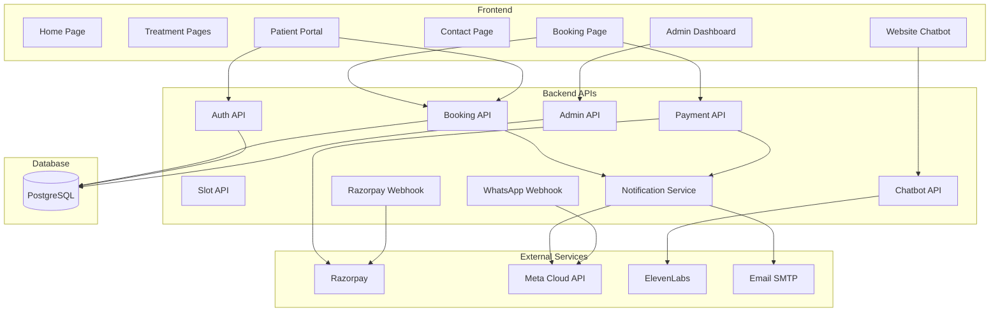

# Website Feature Logic
## Frontend + Backend Interactions
---
## Overview
This document describes the feature logic for every major interaction in the SmileCare dental clinic platform. Each feature is broken down into **Frontend (FE)** behavior, **Backend (BE)** processing, **API contracts**, and **state management**.
---
## FL-01: Home Page
### Frontend
- **Static content** rendered via React components (SSG/SSR via Next.js for SEO)
- **Hero section:** Full-width banner with animated text, CTA button → `/booking`
- **Treatment cards:** Fetched from `GET /api/treatments` → display name, image, tagline
- **Testimonials carousel:** Client-side carousel component, data from CMS or static JSON
- **Stats counter:** Animated number counter (triggered on viewport intersection)
### Backend
| Endpoint | Method | Purpose | Auth |
|----------|--------|---------|------|
| `/api/treatments` | GET | List all treatments (name, slug, tagline, image) | Public |
### Interaction Flow
```
Page Load → Fetch treatments → Render cards
User clicks "Book Appointment" → Navigate to /booking
User clicks treatment card → Navigate to /treatments/[slug]
```
---
## FL-02: About Page
### Frontend
- **Static content** (clinic story, mission statement)
- **Team section:** Dentist profiles from `GET /api/dentists`
- **Gallery:** Lightbox-enabled image grid (images from Cloudinary)
### Backend
| Endpoint | Method | Purpose | Auth |
|----------|--------|---------|------|
| `/api/dentists` | GET | List dentists (name, specialization, bio, photo) | Public |
---
## FL-03: Treatment Pages (Dynamic)
### Frontend
- **Route:** `/treatments/[slug]` (dynamic routing)
- **Content structure:**
  - Hero banner (treatment name + background image)
  - Overview & benefits paragraph
  - Step-by-step procedure (numbered list with icons)
  - Before/After image gallery (swiper component)
  - FAQ accordion (collapsible sections)
  - CTA button → `/booking?treatment=[slug]`
  - Related treatments sidebar (filtered from all treatments)
### Backend
| Endpoint | Method | Purpose | Auth |
|----------|--------|---------|------|
| `/api/treatments/:slug` | GET | Get single treatment full content | Public |
### Response Schema
```json
{
  "id": "uuid",
  "name": "Root Canal",
  "slug": "root-canal",
  "tagline": "Save your natural tooth with painless root canal treatment",
  "heroImage": "https://cdn.example.com/root-canal-hero.jpg",
  "overview": "A root canal is a dental procedure...",
  "benefits": ["Save natural tooth", "Pain relief", "Prevent infection spread"],
  "procedureSteps": [
    { "step": 1, "title": "Diagnosis & X-Ray", "description": "..." },
    { "step": 2, "title": "Anesthesia", "description": "..." },
    { "step": 3, "title": "Pulp Removal", "description": "..." },
    { "step": 4, "title": "Cleaning & Shaping", "description": "..." },
    { "step": 5, "title": "Filling & Sealing", "description": "..." },
    { "step": 6, "title": "Crown Placement", "description": "..." }
  ],
  "beforeAfterImages": [
    { "before": "url", "after": "url", "caption": "Patient case 1" }
  ],
  "faqs": [
    { "question": "Is root canal painful?", "answer": "Modern root canals are virtually painless..." },
    { "question": "How long does it take?", "answer": "Typically 60-90 minutes per visit..." }
  ],
  "priceRange": "₹3,000 – ₹8,000",
  "relatedTreatments": ["dental-implants", "smile-makeover"]
}
```
### Treatment Content Details
#### Root Canal
- **Overview:** Procedure to save a badly damaged or infected tooth by removing the infected pulp
- **Key Symptoms:** Persistent toothache, sensitivity to hot/cold, swollen gums, darkened tooth
- **Procedure:** 6 steps (diagnosis → anesthesia → pulp removal → cleaning → filling → crown)
- **Duration:** 1–2 visits, 60–90 minutes each
- **Aftercare:** Avoid hard foods for 48h, prescribed pain management, follow-up visit
#### Dental Implants
- **Overview:** Permanent tooth replacement using titanium posts surgically placed in jawbone
- **Types:** Single tooth implant, Multiple implants, All-on-4, Implant-supported bridge
- **Candidacy:** Adequate bone density, good oral health, non-smoker preferred
- **Procedure:** Consultation → implant placement → healing (3–6 months) → abutment → crown
- **Aftercare:** Soft diet initially, regular brushing, no smoking, follow-up schedule
#### Teeth Whitening
- **Overview:** Professional bleaching to remove stains and brighten teeth
- **Options:** In-office whitening (1 hour), take-home kit (2 weeks)
- **Expected Results:** 3–8 shades lighter
- **Procedure:** Clean teeth → apply whitening gel → activate with LED light → rinse
- **Aftercare:** Avoid staining foods for 48h (coffee, wine, berries), use sensitivity toothpaste
#### Braces / Orthodontics
- **Overview:** Correct misaligned teeth, bite issues, and jaw alignment
- **Options comparison:**
| Type | Material | Visibility | Duration | Cost Range |
|------|----------|-----------|----------|------------|
| Metal Braces | Stainless steel | Visible | 18–24 months | ₹25,000–₹50,000 |
| Ceramic Braces | Tooth-colored ceramic | Semi-visible | 18–24 months | ₹35,000–₹65,000 |
| Invisalign | Clear plastic aligners | Almost invisible | 12–18 months | ₹80,000–₹2,50,000 |
- **Procedure:** Consultation → impressions/scans → fitting → monthly adjustments → retainer
#### Smile Makeover
- **Overview:** Comprehensive cosmetic plan combining multiple treatments for full smile transformation
- **May include:** Veneers, bonding, whitening, implants, gum contouring, crowns
- **Process:** Detailed consultation → digital smile preview → phased treatment plan
- **Customization:** Each plan is 100% personalized based on patient goals and facial structure
---
## FL-04: Appointment Booking Page
### Frontend — Multi-Step Form
#### Step 1: Treatment Selection
```
State: { treatment: null }
UI: Cards/buttons for each treatment
On select: setState({ treatment: selectedTreatment })
Transition: → Step 2
```
#### Step 2: Dentist Selection (Optional)
```
Fetch: GET /api/dentists?treatment={treatmentId}
State: { dentist: null | selectedDentist }
UI: Dentist cards with photo, name, specialization + "Any Available" option
On select: setState({ dentist: selected })
Transition: → Step 3
```
#### Step 3: Date Selection
```
UI: Calendar component (react-day-picker or similar)
Rules: Disable past dates, Sundays, blocked dates
On select: Fetch GET /api/slots?dentist={id}&date={YYYY-MM-DD}
State: { date: selectedDate, availableSlots: [...] }
Transition: → Step 4
```
#### Step 4: Time Slot Selection
```
UI: Grid of available time slots (e.g., 9:00, 9:30, 10:00...)
Visual: Available = green, Booked = grey (hidden), Selected = blue
On select: setState({ slot: selectedSlot })
Temporary hold: POST /api/slots/:id/hold (5-min server-side hold)
Transition: → Step 5
```
#### Step 5: Patient Details
```
UI: Form fields — Name*, Email*, Phone*, Medical notes (optional)
If logged in: Auto-fill from user profile
Validation:
  - Name: min 2 chars
  - Email: valid format (regex)
  - Phone: 10 digits, starts with 6-9
On submit: Validate → setState({ patientDetails: {...} })
Transition: → Step 6
```
#### Step 6: Payment
```
Action: POST /api/payments/create-order { bookingData }
Response: { orderId, amount: 5000, currency: 'INR' }
UI: Open Razorpay Checkout modal
  Options:
    key: RAZORPAY_KEY_ID
    amount: 5000
    currency: 'INR'
    name: 'SmileCare Dental'
    description: 'Appointment Booking Fee'
    order_id: orderId
    prefill: { name, email, contact }
    handler: onPaymentSuccess(response)
    modal: { ondismiss: onPaymentCancelled() }
onPaymentSuccess:
  POST /api/payments/verify {
    razorpay_order_id,
    razorpay_payment_id,
    razorpay_signature
  }
  If verified → POST /api/bookings (create confirmed booking)
  → Navigate to Step 7
onPaymentCancelled:
  Release slot hold
  Show: "Payment cancelled. Your slot is still available for 5 minutes."
```
#### Step 7: Confirmation
```
UI: Success screen with:
  - ✅ Booking confirmed animation
  - Booking ID
  - Treatment, Dentist, Date, Time
  - "Add to Calendar" button (download .ics)
  - "View your bookings" link → /portal/bookings
Backend triggers (async):
  - Email confirmation sent
  - WhatsApp confirmation sent
  - Admin notification created
  - 24h reminder scheduled
```
### Backend — API Contracts
| Endpoint | Method | Request Body | Response | Auth |
|----------|--------|-------------|----------|------|
| `/api/slots` | GET | Query: `dentist`, `date` | `{ slots: [{ id, startTime, endTime, isAvailable }] }` | Public |
| `/api/slots/:id/hold` | POST | `{ sessionId }` | `{ held: true, expiresAt }` | Public |
| `/api/payments/create-order` | POST | `{ amount, treatmentId, slotId }` | `{ orderId, amount, currency }` | Public |
| `/api/payments/verify` | POST | `{ razorpay_order_id, razorpay_payment_id, razorpay_signature }` | `{ verified: true }` | Public |
| `/api/bookings` | POST | `{ patientDetails, treatmentId, dentistId, slotId, paymentId }` | `{ bookingId, status, details }` | Public |
### State Machine: Booking Status
```
pending_payment → confirmed → completed
                           → no_show
               → cancelled (→ refund_pending → refunded)
```
---
## FL-05: Patient Portal
### Authentication State
```javascript
// AuthContext provides:
{
  user: { id, name, email, role } | null,
  isAuthenticated: boolean,
  login: (email, password) => Promise,
  register: (data) => Promise,
  logout: () => void,
  loading: boolean
}
// Token Management:
// Access token: stored in memory (React state)
// Refresh token: stored in httpOnly cookie
// Auto-refresh: interceptor refreshes token on 401 response
```
### Portal Pages
#### Dashboard (`/portal`)
```
Fetch: GET /api/bookings/my (Auth required)
Display:
  - Upcoming Appointments section
    - Cards with: treatment, dentist, date, time, status
    - Actions: [Reschedule] [Cancel]
  - Past Appointments section
    - Historical list with status (completed, cancelled, no-show)
  - Quick Actions
    - [Book New Appointment] → /booking
    - [Update Profile] → /portal/profile
```
#### Profile (`/portal/profile`)
```
Fetch: GET /api/auth/me
Display & Edit:
  - Name, Email (read-only), Phone
  - Medical notes / allergies (textarea)
  - Change password form
Update: PUT /api/patients/profile
```
### Backend
| Endpoint | Method | Purpose | Auth |
|----------|--------|---------|------|
| `/api/bookings/my` | GET | Patient's own bookings | JWT (patient) |
| `/api/bookings/:id/reschedule` | PUT | Reschedule own booking | JWT (patient) |
| `/api/bookings/:id/cancel` | DELETE | Cancel own booking | JWT (patient) |
| `/api/patients/profile` | GET/PUT | View/update patient profile | JWT (patient) |
---
## FL-06: Contact Page
### Frontend
```
Form Fields:
  - Name* (text)
  - Email* (email)
  - Phone* (tel)
  - Treatment Interest (dropdown: treatments list + "General Inquiry")
  - Message* (textarea, max 500 chars)
Validation:
  - All * fields required
  - Email regex validation
  - Phone: 10 digits
  - Character counter for message
On Submit:
  POST /api/contact → { success: true }
  Show: "Thank you! We'll get back to you within 24 hours."
  Reset form
```
### Backend
| Endpoint | Method | Request | Response |
|----------|--------|---------|----------|
| `/api/contact` | POST | `{ name, email, phone, treatmentInterest, message }` | `{ success: true, id }` |
**Side Effects:**
1. Insert into `contact_submissions` table (status: `new`)
2. Send auto-reply email to patient
3. Create admin dashboard notification
---
## FL-07: Website Chatbot
### Frontend Component
```
UI Structure:
  ┌─────────────────────────┐
  │ SmileCare Assistant  🔊 │  ← Header (voice toggle)
  ├─────────────────────────┤
  │                         │
  │  Bot: Hi! How can I     │  ← Message area (scrollable)
  │  help you today?        │
  │                         │
  │  [Book] [Treatments]    │  ← Quick reply buttons
  │  [Hours] [Contact]      │
  │                         │
  │        User: I want     │
  │        to book          │
  │                         │
  │  Bot: Sure! Click here  │
  │  to book: [Book Now →]  │
  │                         │
  ├─────────────────────────┤
  │ 🎤 Type a message... [→]│  ← Input area
  └─────────────────────────┘
```
### State Management
```javascript
const [messages, setMessages] = useState([]);       // Chat history
const [isOpen, setIsOpen] = useState(false);         // Chat window visibility
const [isListening, setIsListening] = useState(false); // Voice input active
const [voiceEnabled, setVoiceEnabled] = useState(false); // TTS enabled
const [isTyping, setIsTyping] = useState(false);     // Bot typing indicator
```
### Voice Input (Web Speech API)
```javascript
const recognition = new (window.SpeechRecognition || window.webkitSpeechRecognition)();
recognition.continuous = false;
recognition.interimResults = false;
recognition.lang = 'en-IN';
recognition.onresult = (event) => {
  const transcript = event.results[0][0].transcript;
  sendMessage(transcript); // Process as text
};
recognition.onerror = (event) => {
  console.error('Speech error:', event.error);
  setIsListening(false);
  // Fallback: prompt text input
};
```
### Voice Output (ElevenLabs TTS)
```javascript
async function speakResponse(text) {
  if (!voiceEnabled) return;
  
  const response = await fetch('/api/chatbot/voice', {
    method: 'POST',
    headers: { 'Content-Type': 'application/json' },
    body: JSON.stringify({ text })
  });
  
  const audioBlob = await response.blob();
  const audioUrl = URL.createObjectURL(audioBlob);
  const audio = new Audio(audioUrl);
  audio.play();
}
```
### Backend
| Endpoint | Method | Request | Response |
|----------|--------|---------|----------|
| `/api/chatbot/message` | POST | `{ message, sessionId }` | `{ reply, quickReplies?, intent }` |
| `/api/chatbot/voice` | POST | `{ text }` | Binary audio (MP3) |
**`/api/chatbot/voice` Implementation:**
```javascript
// ElevenLabs TTS
const response = await fetch(
  `https://api.elevenlabs.io/v1/text-to-speech/${VOICE_ID}`,
  {
    method: 'POST',
    headers: {
      'xi-api-key': ELEVENLABS_API_KEY,
      'Content-Type': 'application/json'
    },
    body: JSON.stringify({
      text: inputText,
      model_id: 'eleven_monolingual_v1',
      voice_settings: { stability: 0.5, similarity_boost: 0.75 }
    })
  }
);
// Stream audio bytes back to client
```
---
## FL-08: Admin Dashboard
### Layout Structure
```
┌──────────────────────────────────────────────────┐
│ 🦷 SmileCare Admin                    🔔(3) 👤  │  ← Top bar
├──────────┬───────────────────────────────────────┤
│ Navigation│                                      │
│          │         Main Content Area             │
│ 📊 Home  │                                      │
│ 👥 Patients│                                     │
│ 📅 Calendar│                                     │
│ ⚙️ Slots  │                                      │
│ 📝 Contacts│                                     │
│ 💬 Chats  │                                      │
│ 📈 Analytics│                                    │
│ ⚙️ Settings│                                     │
│          │                                      │
└──────────┴───────────────────────────────────────┘
```
### Key Features & API Mapping
#### Patient List Page
```
Fetch: GET /api/admin/patients?search=&page=&limit=
Display: Searchable, sortable table
  Columns: Name | Phone | Email | Last Visit | Total Visits | Actions
  Actions: [View Details] → Patient detail panel
    - Personal info
    - Booking history (all bookings)
    - Medical notes (editable)
    - Payment history
```
#### Booking Calendar Page
```
Fetch: GET /api/admin/bookings?startDate=&endDate=&dentist=
Display: Calendar component (day/week/month views)
  - Color-coded by status:
    🟢 Confirmed   🟡 Pending   🔴 Cancelled   🔵 Completed   ⚫ No-show
  - Click booking → Detail modal
  - Drag booking → Reschedule (admin override)
Filters: By dentist, by treatment, by status
```
#### Slot Management Page
```
Fetch: GET /api/admin/slots?dentist=&week=
Display: Weekly grid per dentist
  - Toggle slots on/off by clicking cells
  - Bulk actions: "Block entire day", "Apply weekly template"
  - Save: PUT /api/admin/slots/bulk
```
#### Notification Center
```
Fetch: GET /api/admin/notifications?unread=true
Display: Dropdown from bell icon + full page view
  - Types: new_booking, cancellation, contact_form, chat_escalation, payment_event
  - Mark as read: PUT /api/admin/notifications/:id/read
  - Mark all read: PUT /api/admin/notifications/read-all
Real-time: WebSocket or polling (every 30s)
```
#### Analytics Page
```
Fetch: GET /api/admin/analytics?period=week|month|year
Display:
  - Booking trend chart (line graph)
  - Revenue summary (bar chart)
  - Treatment popularity (pie/donut chart)
  - No-show rate (percentage card)
  - Today's snapshot: X bookings, Y revenue, Z new patients
```
### Backend — Admin API Contracts
| Endpoint | Method | Purpose | Auth |
|----------|--------|---------|------|
| `/api/admin/patients` | GET | List patients (paginated, searchable) | JWT (admin/receptionist) |
| `/api/admin/patients/:id` | GET | Patient detail + history | JWT (admin/receptionist) |
| `/api/admin/bookings` | GET | All bookings (filterable) | JWT (admin/receptionist) |
| `/api/admin/bookings` | POST | Manual booking creation | JWT (admin/receptionist) |
| `/api/admin/slots/bulk` | PUT | Bulk update slot availability | JWT (admin) |
| `/api/admin/notifications` | GET | List notifications | JWT (admin/receptionist) |
| `/api/admin/analytics` | GET | Dashboard analytics data | JWT (admin) |
| `/api/admin/treatments/:id` | PUT | Update treatment content | JWT (admin) |
---
## FL-09: Email System
### Templates & Triggers
| Template | Trigger | Key Data |
|----------|---------|----------|
| `booking_confirmed.hbs` | New booking confirmed | Patient name, treatment, dentist, date, time, booking ID |
| `booking_rescheduled.hbs` | Booking rescheduled | Old date/time, new date/time, booking ID |
| `booking_cancelled.hbs` | Booking cancelled | Cancellation reason, refund eligibility, booking ID |
| `appointment_reminder.hbs` | 24h before appointment | Patient name, treatment, date, time, clinic address |
| `payment_receipt.hbs` | Payment captured | Amount, transaction ID, date, booking reference |
| `contact_auto_reply.hbs` | Contact form submitted | Patient name, inquiry reference number |
| `password_reset.hbs` | Password reset requested | OTP code, expiry time |
### Calendar Invite (.ics) Generation
```javascript
// Generated and attached to booking_confirmed email
const icsContent = `BEGIN:VCALENDAR
VERSION:2.0
BEGIN:VEVENT
DTSTART:${formatDate(booking.appointmentDate)}
DTEND:${formatDate(addMinutes(booking.appointmentDate, 30))}
SUMMARY:Dental Appointment - ${booking.treatment.name}
DESCRIPTION:Appointment with Dr. ${booking.dentist.name}
LOCATION:SmileCare Dental Clinic, [Clinic Address]
END:VEVENT
END:VCALENDAR`;
```
---
## FL-10: WhatsApp Integration
### Meta Cloud API Setup
```
Webhook URL: https://api.smilecare.com/api/webhooks/whatsapp
Verify Token: WHATSAPP_VERIFY_TOKEN
Webhook Fields: messages, message_deliveries, message_reads
```
### Webhook Handler
```javascript
// GET — Webhook verification
app.get('/api/webhooks/whatsapp', (req, res) => {
  const mode = req.query['hub.mode'];
  const token = req.query['hub.verify_token'];
  const challenge = req.query['hub.challenge'];
  if (mode === 'subscribe' && token === VERIFY_TOKEN) {
    return res.status(200).send(challenge);
  }
  res.sendStatus(403);
});
// POST — Incoming messages
app.post('/api/webhooks/whatsapp', async (req, res) => {
  const message = extractMessage(req.body);
  if (!message) return res.sendStatus(200);
  
  const intent = classifyIntent(message.text);
  const response = await generateResponse(intent, message);
  await sendWhatsAppMessage(message.from, response);
  await logMessage(message, response);
  
  res.sendStatus(200);
});
```
### Send Message Function
```javascript
async function sendWhatsAppMessage(to, body) {
  await fetch(`https://graph.facebook.com/v18.0/${PHONE_NUMBER_ID}/messages`, {
    method: 'POST',
    headers: {
      'Authorization': `Bearer ${WHATSAPP_TOKEN}`,
      'Content-Type': 'application/json'
    },
    body: JSON.stringify({
      messaging_product: 'whatsapp',
      to: to,
      type: 'text',
      text: { body: body }
    })
  });
}
```
### Template Message (for confirmations/reminders)
```javascript
async function sendTemplateMessage(to, templateName, parameters) {
  await fetch(`https://graph.facebook.com/v18.0/${PHONE_NUMBER_ID}/messages`, {
    method: 'POST',
    headers: {
      'Authorization': `Bearer ${WHATSAPP_TOKEN}`,
      'Content-Type': 'application/json'
    },
    body: JSON.stringify({
      messaging_product: 'whatsapp',
      to: to,
      type: 'template',
      template: {
        name: templateName,
        language: { code: 'en' },
        components: [{
          type: 'body',
          parameters: parameters.map(p => ({ type: 'text', text: p }))
        }]
      }
    })
  });
}
```
---
## FL-11: Razorpay Payment Integration
### Frontend Integration
```javascript
function initiatePayment(orderData) {
  const options = {
    key: process.env.NEXT_PUBLIC_RAZORPAY_KEY_ID,
    amount: orderData.amount, // 5000 paise = ₹50
    currency: 'INR',
    name: 'SmileCare Dental Clinic',
    description: 'Appointment Booking Fee',
    order_id: orderData.razorpayOrderId,
    prefill: {
      name: patientDetails.name,
      email: patientDetails.email,
      contact: patientDetails.phone
    },
    theme: { color: '#4CAF50' },
    handler: async function (response) {
      // Verify payment on server
      const result = await fetch('/api/payments/verify', {
        method: 'POST',
        body: JSON.stringify({
          razorpay_order_id: response.razorpay_order_id,
          razorpay_payment_id: response.razorpay_payment_id,
          razorpay_signature: response.razorpay_signature
        })
      });
      if (result.verified) {
        // Create booking
        await createBooking();
      }
    },
    modal: {
      ondismiss: function () {
        // Payment modal closed without completing
        releaseSlotHold();
      }
    }
  };
  
  const razorpay = new window.Razorpay(options);
  razorpay.open();
}
```
### Backend — Payment Verification
```javascript
const crypto = require('crypto');
function verifyPayment(orderId, paymentId, signature) {
  const body = orderId + '|' + paymentId;
  const expectedSignature = crypto
    .createHmac('sha256', process.env.RAZORPAY_KEY_SECRET)
    .update(body.toString())
    .digest('hex');
  
  return expectedSignature === signature;
}
```
### Webhook Handler
```javascript
app.post('/api/webhooks/razorpay', (req, res) => {
  const webhookSignature = req.headers['x-razorpay-signature'];
  const isValid = Razorpay.validateWebhookSignature(
    JSON.stringify(req.body),
    webhookSignature,
    process.env.RAZORPAY_WEBHOOK_SECRET
  );
  
  if (!isValid) return res.sendStatus(401);
  
  const event = req.body.event;
  switch (event) {
    case 'payment.captured':
      // Update payment status → captured
      break;
    case 'payment.failed':
      // Update payment status → failed, notify admin
      break;
    case 'refund.processed':
      // Update refund status → processed, notify patient
      break;
  }
  
  res.sendStatus(200);
});
```
---
## Cross-Feature Integration Summary
