# Workflow Definitions
**Purpose:** Key user and system workflows with sequences, actors, triggers, decision points, and Mermaid diagrams.
---
## WF-01: Patient Appointment Booking (End-to-End)
**Trigger:** Patient visits the booking page.
**Actors:** Patient, Website Frontend, Booking Agent, Payment Agent, Notification Agent, Reminder Agent, Loyalty Agent.
### Flow Diagram
```mermaid
flowchart TD
    A["Patient opens Booking Page"] --> B["Fetch & display treatments"]
    B --> C["Patient selects treatment"]
    C --> D{"Select dentist?"}
    D -- Yes --> E["Show dentist profiles & availability"]
    D -- No --> F["Auto-assign or show all slots"]
    E --> G["Patient picks a date"]
    F --> G
    G --> H["GET /api/slots → show available slots"]
    H --> I{"Slots available?"}
    I -- No --> J["Show 'No slots' message + suggest alternate dates"]
    J --> G
    I -- Yes --> K["Patient selects time slot"]
    K --> L["Slot temporarily held (5-min hold timer)"]
    L --> M["Patient fills details: name, email, phone, notes"]
    M --> N{"Client-side validation passed?"}
    N -- No --> O["Show validation errors"]
    O --> M
    N -- Yes --> P{"Promo code entered?"}
    P -- Yes --> Q["Validate promo code → adjust amount"]
    P -- No --> R["Standard ₹50 booking fee"]
    Q --> S["Click 'Confirm & Pay'"]
    R --> S
    S --> T["POST /api/payments/create-order → Razorpay order"]
    T --> U["Razorpay payment modal opens"]
    U --> V{"Payment successful?"}
    V -- No --> W{"Retry or cancel?"}
    W -- Retry --> U
    W -- Cancel --> X["Release held slot, show failure message"]
    V -- Yes --> Y["POST /api/payments/verify → verify signature"]
    Y --> Z{"Signature valid?"}
    Z -- No --> AA["Flag for manual review, notify admin"]
    Z -- Yes --> AB["POST /api/bookings → status = confirmed"]
    AB --> AC["Release slot hold → mark slot as booked"]
    AC --> AD["Send email confirmation + .ics invite"]
    AD --> AE["Send WhatsApp confirmation"]
    AE --> AF["Create admin dashboard notification"]
    AF --> AG["Schedule 24h reminder"]
    AG --> AH["Schedule post-visit feedback (2h after appointment)"]
    AH --> AI{"Referral code used?"}
    AI -- Yes --> AJ["Record referral, pending bonus credit"]
    AI -- No --> AK["Booking complete"]
    AJ --> AK
    AK --> AL["Display confirmation screen with:\n- Booking summary & reference ID\n- Add to Calendar buttons\n- View in Portal link\n- Share on WhatsApp button"]
```
### Step-by-Step Reference
| Step | Action | System Component | Notes |
|---|---|---|---|
| 1 | Patient selects treatment | Frontend | Visual cards with icons, names, and starting prices |
| 2 | (Optional) Select dentist | Frontend | Show dentist cards with photo, specialization, next availability |
| 3 | Pick a date | Frontend → `GET /api/slots` | Calendar widget; past, blocked, and fully-booked dates disabled |
| 4 | Show available slots | Booking Agent | Queries DB for date/dentist; respects buffer time and emergency reserves |
| 5 | Patient selects time slot | Frontend | Slot grouped by Morning/Afternoon/Evening. 5-min hold timer starts |
| 6 | Fill details | Frontend | Name (≥2 chars), email (format), phone (10-digit), age, notes. Client-side validation |
| 7 | Apply promo code (optional) | Frontend → Loyalty Agent | Validate code, calculate discount. Show adjusted amount |
| 8 | Click "Confirm & Pay" | Frontend → `POST /api/payments/create-order` | Razorpay order created (₹50 or adjusted) |
| 9 | Payment via Razorpay | Razorpay SDK | Secure modal. User completes or cancels |
| 10 | Verify payment | Payment Agent (`POST /api/payments/verify`) | Verify signature using Razorpay secret key |
| 11 | Booking confirmed | Booking Agent | `status = confirmed`, slot permanently marked booked |
| 12 | Send notifications | Notification Agent | Email (with `.ics`) + WhatsApp confirmation |
| 13 | Admin alerted | Notification Agent | Dashboard real-time notification created |
| 14 | Schedule reminder | Reminder Agent | Cron job will send 24h reminder |
| 15 | Schedule feedback | Reminder Agent | Post-visit feedback request 2h after appointment |
| 16 | Referral check | Loyalty Agent | If referral code used, link referrer to this booking |
| 17 | Confirmation screen | Frontend | Summary, calendar buttons, portal link, WhatsApp share |
### Error Handling
| Failure Point | Recovery Action |
|---|---|
| Slot hold expires (5 min) | Release slot, prompt patient to re-select |
| Payment fails / user cancels | Release held slot, show retry option or manual booking link |
| Payment captured but verify fails | Flag booking for admin review, do not confirm automatically |
| Email/WhatsApp send fails | Retry up to 3 times, log failure, create admin notification for manual follow-up |
| Razorpay webhook timeout | Backend polls Razorpay API as fallback to confirm payment status |
---
## WF-02: Appointment Rescheduling
**Trigger:** Patient requests reschedule (via Patient Portal, WhatsApp chatbot, or phone call to receptionist).
**Actors:** Patient (or Receptionist on behalf), Booking Agent, Notification Agent, Reminder Agent.
### Flow Diagram
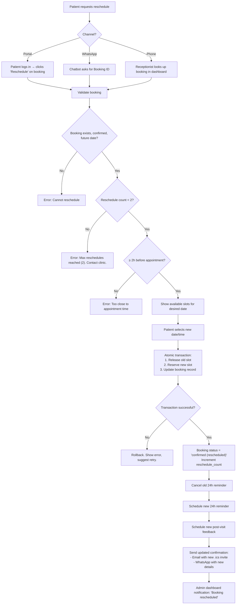
### Business Rules
| Rule | Detail |
|---|---|
| Time limit | Must reschedule ≥2 hours before the original appointment |
| Max reschedules | 2 per booking. After that, patient must cancel and rebook. |
| Cost | No extra charge for rescheduling |
| Slot handling | Old slot freed immediately in the same DB transaction as new slot reservation |
| Notifications | All parties (patient, dentist, admin) receive updated details |
---
## WF-03: Appointment Cancellation & Refund
**Trigger:** Patient requests cancellation via portal, WhatsApp, phone, or admin initiates on behalf.
**Actors:** Patient/Receptionist, Booking Agent, Payment Agent, Notification Agent.
### Flow Diagram
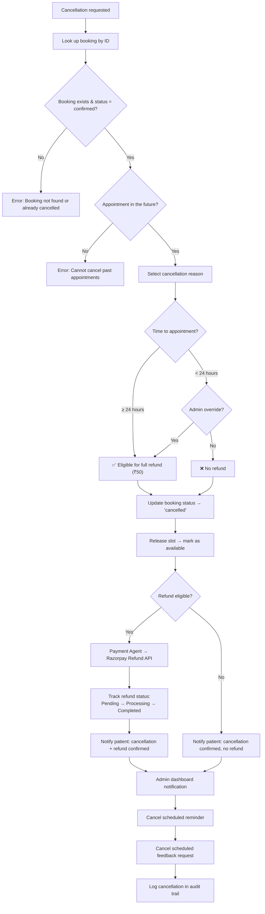
### Refund Policy Table
| Timing | Refund | Processing |
|---|---|---|
| ≥24h before appointment | ✅ Full refund (₹50) | Automatic via Razorpay. 5–7 business days. |
| <24h before appointment | ❌ No refund | Unless Admin manually overrides |
| No-show | ❌ No refund | Booking marked as no-show |
| System/clinic cancellation | ✅ Full refund | Admin initiates. Always refunded. |
---
## WF-04: Automated 24-Hour Reminder
**Trigger:** Scheduled cron job (runs every 30 minutes).
**Actors:** Reminder Agent, Notification Agent, WhatsApp Agent.
### Flow Diagram
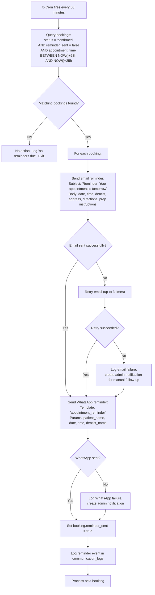
### Reminder Content
| Channel | Content |
|---|---|
| **Email** | Subject: *"Reminder: Your appointment is tomorrow at [Time]"*. Body includes: date, time, dentist name, clinic address with Google Maps link, preparation tips (e.g., "Please arrive 10 minutes early"), cancellation/reschedule link, clinic contact number. |
| **WhatsApp** | Template message: *"🔔 Hi [Name], this is a reminder about your appointment tomorrow at [Time] with Dr. [Dentist] at SmileCare. 📍 [Address]. Need to reschedule? Reply 'reschedule' or call [Number]."* |
---
## WF-05: Post-Visit Feedback & Review Collection *(NEW)*
**Trigger:** Scheduled cron job (runs every 30 minutes) checks for completed appointments.
**Actors:** Reminder Agent, Notification Agent, Patient, Admin.
### Flow Diagram
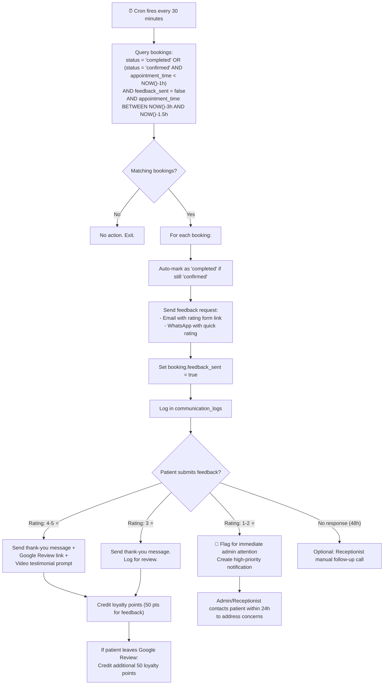
### Feedback Actions by Rating
| Rating | Automated Response | Staff Action |
|---|---|---|
| ⭐⭐⭐⭐⭐ (5) | Thank you + Google Review link + video testimonial invite | None (celebrate!) |
| ⭐⭐⭐⭐ (4) | Thank you + Google Review link | None |
| ⭐⭐⭐ (3) | Thank you message | Review feedback notes for improvement insights |
| ⭐⭐ (2) | Apology + "We'd like to make it right" | Receptionist calls within 24h |
| ⭐ (1) | Apology + escalation notice | Admin calls within 12h. High-priority. |
---
## WF-06: Website Chatbot Conversation
**Trigger:** Patient opens the chat widget on the website.
**Actors:** Patient, Web Chatbot Agent, Booking Agent, Notification Agent.
### Flow Diagram
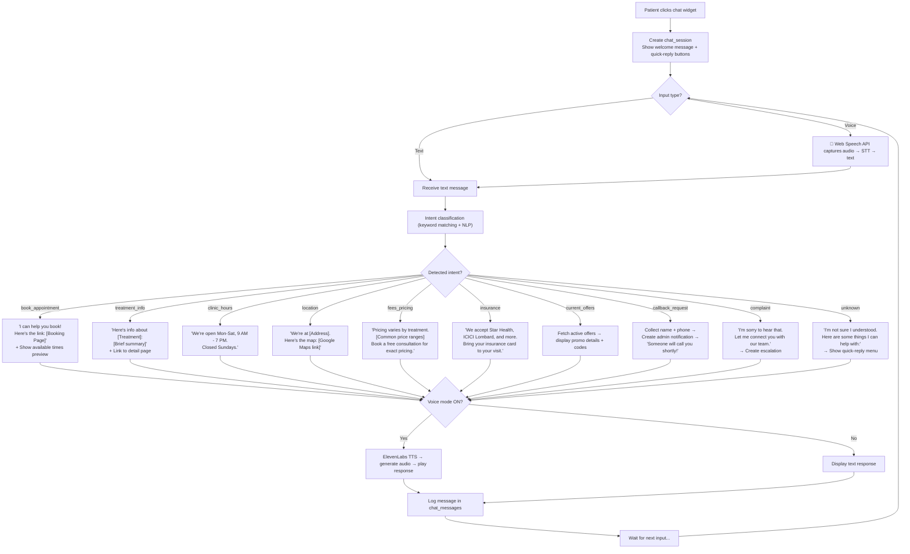
### Quick-Reply Buttons (Default)
| Button | Mapped Intent |
|---|---|
| 📅 Book Appointment | `book_appointment` |
| 🦷 Our Treatments | `treatment_info` (shows treatment categories) |
| ⏰ Clinic Hours | `clinic_hours` |
| 📍 Location | `location` |
| 🎉 Current Offers | `current_offers` |
| 📞 Contact Us | `callback_request` |
### Voice Pipeline
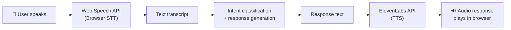
---
## WF-07: WhatsApp Chatbot Flow
**Trigger:** Patient sends a WhatsApp message to the clinic's business number.
**Actors:** Patient, WhatsApp Agent (Meta Cloud API), Booking Agent, Payment Agent.
### Inbound Message Processing
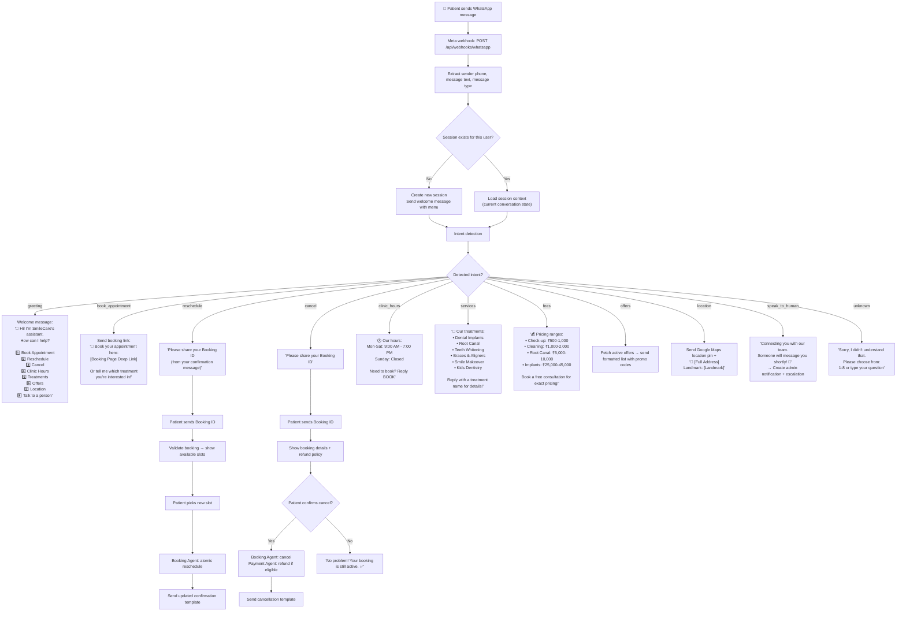
### Outbound System-Initiated Messages
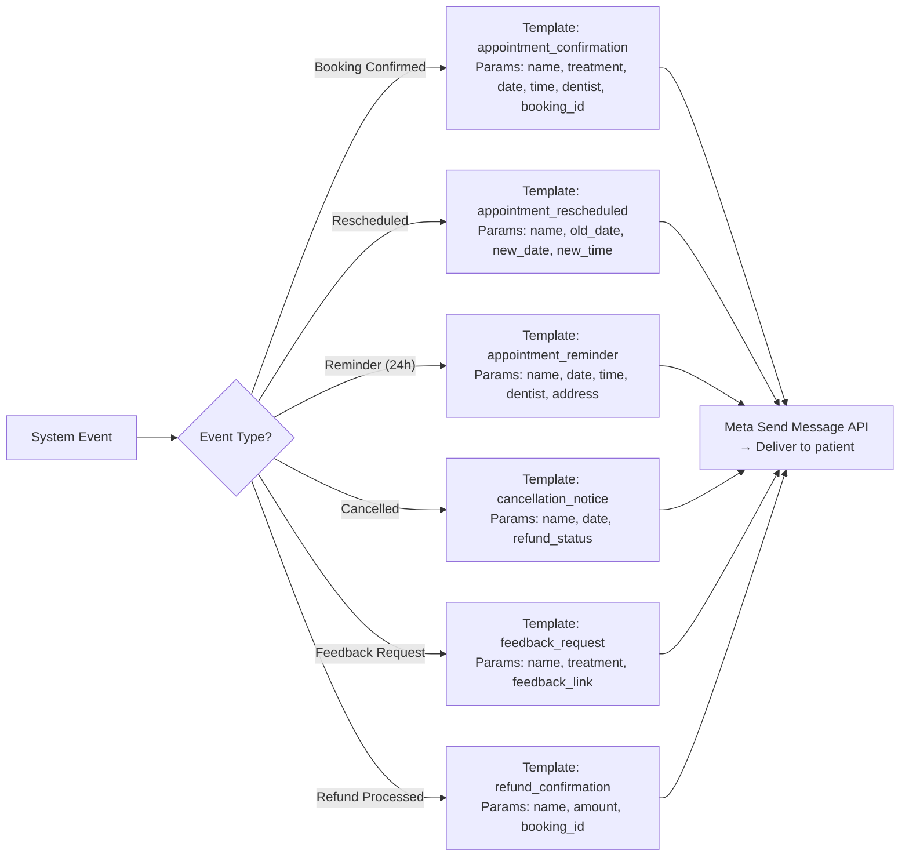
---
## WF-08: Patient Registration & Login
**Trigger:** Patient clicks "Register" or "Login" on the website.
**Actors:** Patient, Auth Agent, Notification Agent.
### Registration Flow
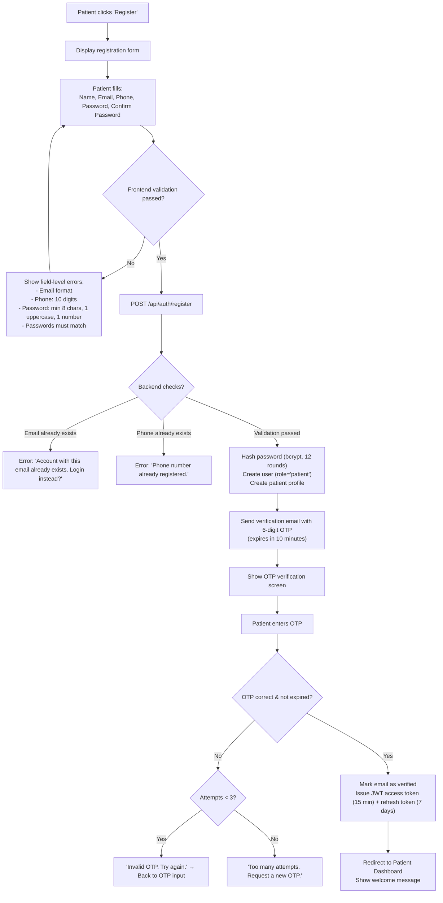
### Login Flow
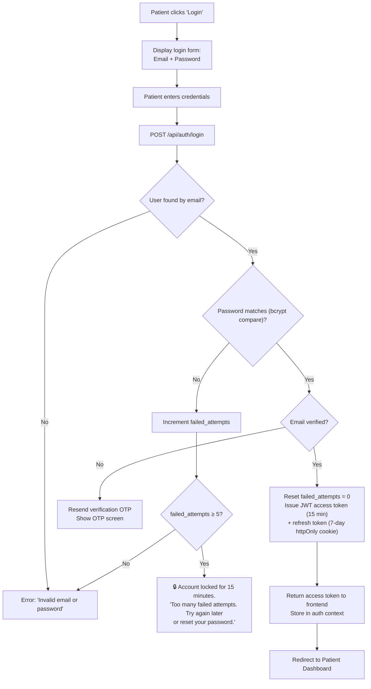
### Password Reset Flow
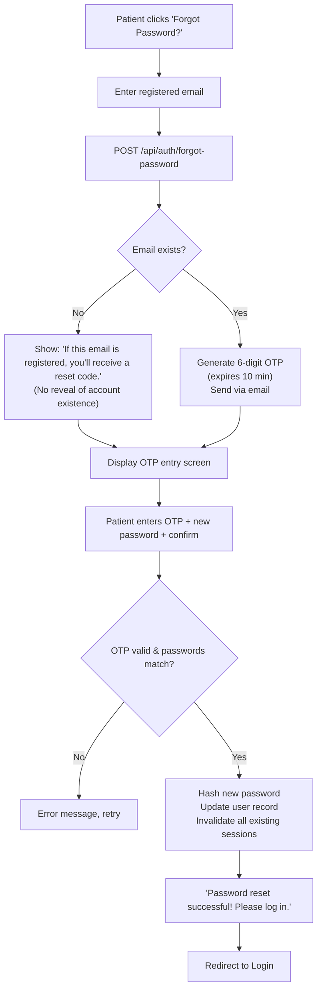
### Token Refresh Flow
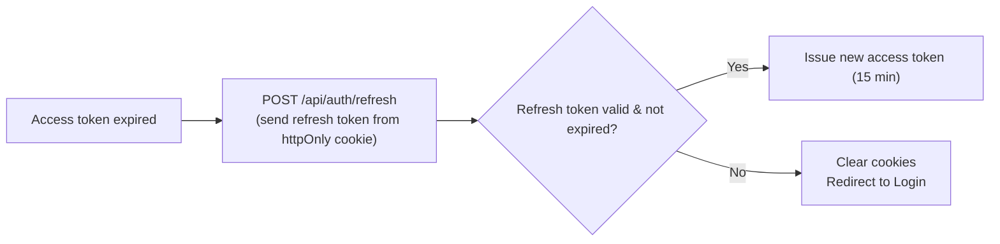
---
## WF-09: Contact Form Submission
**Trigger:** Patient submits the contact page form.
**Actors:** Patient, Frontend, Notification Agent, Admin/Receptionist.
### Flow Diagram
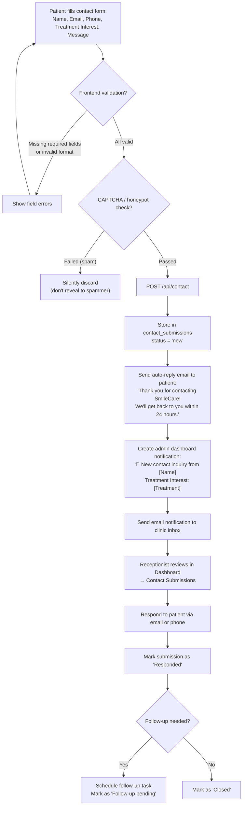
### Response Time Targets
| Priority | Criteria | Target Response Time |
|---|---|---|
| High | Treatment Interest = Emergency / Pain | Within 1 hour |
| Medium | Treatment Interest = specific treatment | Within 4 hours |
| Normal | General inquiry | Within 24 hours |
---
## WF-10: Admin Daily Operations
**Trigger:** Admin or Receptionist logs into the dashboard at start of day.
**Actors:** Admin/Receptionist, Admin Dashboard, all backend agents.
### Morning Opening Flow
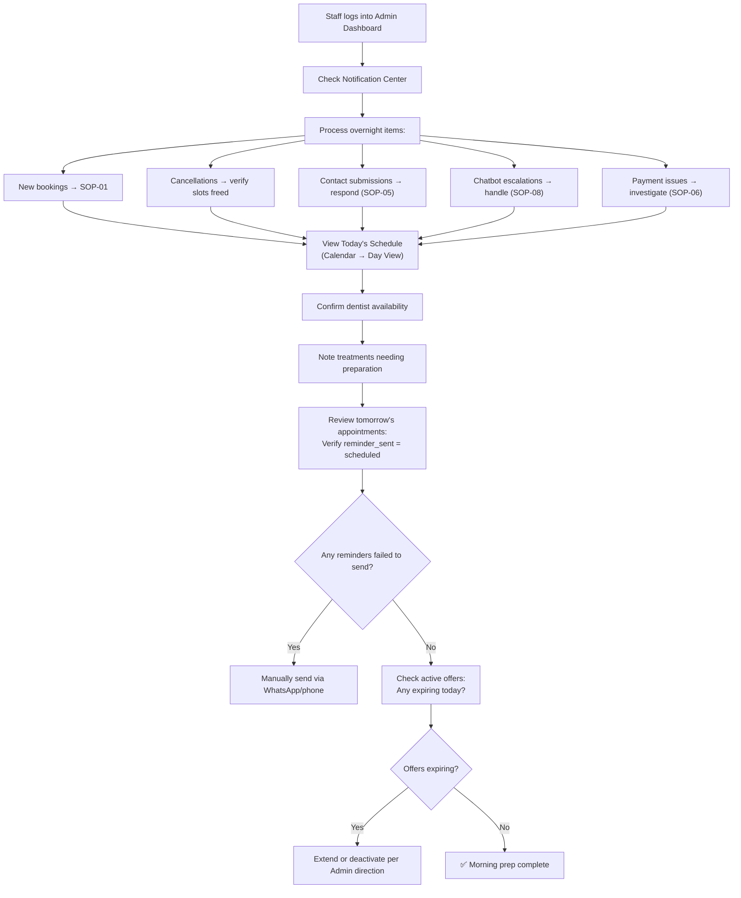
### During-the-Day Flow
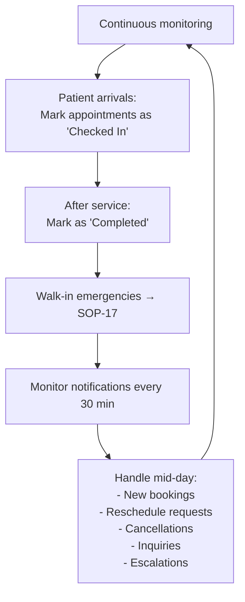
### Evening Closing Flow
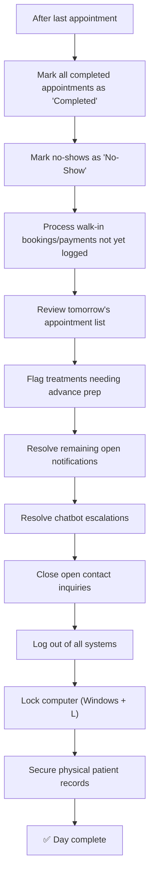
---
## WF-11: Video Testimonial Collection & Publishing *(NEW)*
**Trigger:** Patient completes a successful treatment; or patient submits a video via the website form.
**Actors:** Receptionist, Patient, Admin, Content Agent.
### Flow Diagram
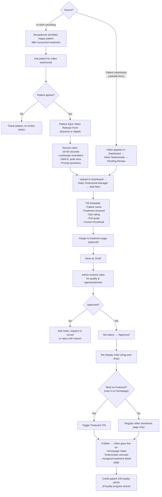
### Quality Checklist
| Check | Pass Criteria |
|---|---|
| Consent form signed | ✅ On file |
| Duration | 30–90 seconds |
| Resolution | ≥ 720p (1080p preferred) |
| Audio clarity | Clear speech, no background noise |
| Lighting | Well-lit face, no harsh shadows |
| Content | Positive, mentions treatment, no competitor names |
| Thumbnail | Custom thumbnail showing patient smiling |
---
## WF-12: Blog Post Publishing *(NEW)*
**Trigger:** Admin or dentist decides to publish educational content.
**Actors:** Admin, Dentist (author/reviewer), Content Agent.
### Flow Diagram
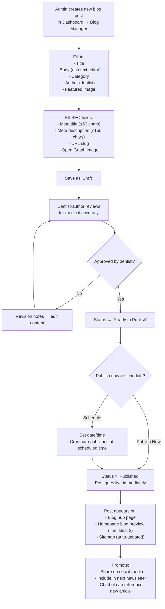
### Content Guidelines
| Rule | Guideline |
|---|---|
| Word count | 600–1200 words |
| Language | Patient-friendly, minimal jargon |
| Images | ≥1 relevant image per post |
| Internal links | ≥1 link to a treatment page or booking page |
| CTA | End with: *"Have questions? Book a free consultation →"* |
| Medical advice | Never diagnose — always recommend in-person consultation |
| Frequency | Minimum 2 posts per month |
---
## WF-13: Offer & Promo Code Lifecycle *(NEW)*
**Trigger:** Admin decides to run a promotional campaign.
**Actors:** Admin, Content Agent, Booking Agent, Loyalty Agent.
### Flow Diagram
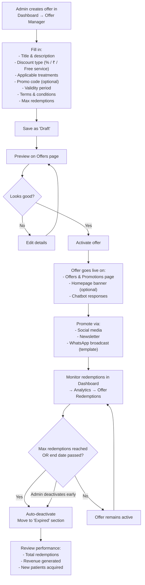
### Promo Code Validation (During Booking)
```mermaid
flowchart TD
    A["Patient enters promo code\nat booking checkout"] --> B["Frontend sends code to\nPOST /api/loyalty/promo/validate"]
    B --> C{"Code exists?"}
    C -- No --> D["Error: 'Invalid promo code'"]
    C -- Yes --> E{"Code active & within validity?"}
    E -- No --> F["Error: 'This offer has expired'"]
    E -- Yes --> G{"Max redemptions reached?"}
    G -- Yes --> H["Error: 'This offer is fully redeemed'"]
    G -- No --> I{"Applicable to selected treatment?"}
    I -- No --> J["Error: 'Not valid for this treatment'"]
    I -- Yes --> K["✅ Apply discount\nShow adjusted amount"]
```
---
## WF-14: Loyalty Points & Referral Flow *(NEW)*
**Trigger:** Patient completes an appointment, submits a review, or refers a friend.
**Actors:** Patient, Loyalty Agent, Booking Agent, Notification Agent.
### Points Earning Flow
```mermaid
flowchart TD
    A["Appointment marked 'Completed'"] --> B["Booking Agent triggers\nLoyalty Agent → POST /api/loyalty/earn"]
    B --> C{"Treatment tier?"}
    C -- General consultation --> D["Credit 50 points"]
    C -- Standard treatment --> E["Credit 100 points"]
    C -- Premium treatment --> F["Credit 200 points"]
    D & E & F --> G["Update loyalty_points balance\nLog in loyalty_transactions"]
    G --> H["Send notification:\n'🎉 You earned [X] points!\nBalance: [Total] points'"]
    
    I["Patient submits video testimonial"] --> J["Credit 100 points"]
    J --> G
    
    K["Patient posts Google review"] --> L["Credit 50 points"]
    L --> G
```
### Referral Flow
```mermaid
flowchart TD
    A["Patient A shares referral code/link\nfrom Patient Portal"] --> B["Patient B opens booking page\nvia referral link"]
    B --> C["Referral code auto-filled\nor Patient B enters manually"]
    C --> D["Patient B completes booking\nwith payment"]
    D --> E["Record referral:\nreferrer = Patient A\nreferred = Patient B\nstatus = 'pending'"]
    E --> F["Patient B attends appointment"]
    F --> G["Appointment marked 'Completed'"]
    G --> H["Referral status → 'completed'"]
    H --> I["Credit Patient A: 200 bonus points"]
    H --> J["Credit Patient B: 200 bonus points"]
    I --> K["Notify Patient A:\n'🎉 Your friend visited us!\nYou earned 200 bonus points!'"]
    J --> L["Notify Patient B:\n'🎉 Welcome bonus!\nYou earned 200 referral points!'"]
```
### Points Redemption Flow
```mermaid
flowchart TD
    A["Patient checks points balance\nin Portal → Loyalty & Rewards"] --> B["Patient clicks 'Redeem Points'\nduring booking"]
    B --> C["Enter points to redeem\n(100 points = ₹100)"]
    C --> D{"Sufficient balance?"}
    D -- No --> E["Error: 'Insufficient points.\nBalance: [X] points'"]
    D -- Yes --> F["Calculate discount amount"]
    F --> G{"Discount > booking amount?"}
    G -- Yes --> H["Cap discount at booking amount\n(₹50 max for booking fee)"]
    G -- No --> I["Apply full discount"]
    H --> J["Adjusted payment amount\nshown at checkout"]
    I --> J
    J --> K["Payment completed\nPoints deducted from balance"]
    K --> L["Log redemption in\nloyalty_transactions"]
```
---
## WF-15: Emergency Walk-In Handling *(NEW)*
**Trigger:** Patient arrives at the clinic without an appointment, with an urgent dental issue.
**Actors:** Receptionist, Dentist, Booking Agent.
### Flow Diagram
```mermaid
flowchart TD
    A["Patient walks in with\ndental emergency"] --> B["Receptionist assesses urgency"]
    B --> C{"Life-threatening?\n(breathing difficulty,\nuncontrolled bleeding,\nfacial trauma)"}
    C -- Yes --> D["🚨 Call 112 (Emergency Services)\nDo NOT attempt dental treatment"]
    C -- No --> E["Check dashboard for\nemergency slots today"]
    E --> F{"Emergency slot available?"}
    F -- Yes --> G["Create booking via admin dashboard\nAssign to available dentist"]
    F -- No --> H{"Any regular slots open?"}
    H -- Yes --> G
    H -- No --> I["Inform patient:\n'Earliest available: [time]'\nOffer to wait or book next slot"]
    I --> J{"Patient agrees to wait/book?"}
    J -- Yes --> G
    J -- No --> K["Provide referral to nearby\nemergency dental clinic\nLog in dashboard"]
    
    G --> L{"Patient in system?"}
    L -- Yes --> M["Pull up existing record"]
    L -- No --> N["Quick registration:\nName, Phone only\n(full registration after treatment)"]
    M --> O["Collect ₹50 fee at counter\n(Cash / UPI scan)"]
    N --> O
    O --> P["Notify dentist immediately\n(in-person or dashboard alert)"]
    P --> Q["Patient receives treatment"]
    Q --> R["Complete full registration\nif new patient"]
    R --> S["Standard post-visit follow-up\napplies (WF-05)"]
```
---
## WF-16: Newsletter Campaign Flow *(NEW)*
**Trigger:** Admin decides to send a newsletter (recommended: 1–2 per month).
**Actors:** Admin, Mailchimp/SendGrid, Subscribers.
### Flow Diagram
```mermaid
flowchart TD
    A["Admin plans newsletter content"] --> B["Content ideas:\n- Latest blog posts\n- Current offers\n- Seasonal dental tips\n- Clinic news\n- New dentist/service announcement"]
    B --> C["Draft email in Mailchimp/SendGrid\nusing branded template"]
    C --> D["Include:\n- Clinic logo & branding\n- 2-3 content blocks\n- CTA: Book Appointment\n- Social media links\n- Unsubscribe link"]
    D --> E["Send test email to admin"]
    E --> F{"Test looks good?"}
    F -- No --> G["Edit content/design"]
    G --> E
    F -- Yes --> H{"Send now or schedule?"}
    H -- "Send Now" --> I["Send to all active subscribers"]
    H -- "Schedule" --> J["Set date/time\n(Recommended: Tue-Thu,\n10 AM - 12 PM)"]
    J --> I
    I --> K["Monitor delivery metrics:\n- Sent count\n- Open rate (target ≥ 25%)\n- Click rate (target ≥ 5%)\n- Bounce rate\n- Unsubscribe rate (< 1%)"]
    K --> L["Log campaign results\nin Dashboard → Newsletter → Reports"]
```
### Subscriber Management
```mermaid
flowchart TD
    A{"How subscriber was added?"} 
    A -- "Website signup form" --> B["Auto-added to Mailchimp/SendGrid list\n+ logged in Dashboard → Newsletter → Subscribers"]
    A -- "In-clinic request" --> C["Receptionist manually adds\nemail to subscriber list"]
    
    D{"Unsubscribe request?"}
    D -- "Via email unsubscribe link" --> E["Auto-removed by\nMailchimp/SendGrid"]
    D -- "Via phone/WhatsApp" --> F["Receptionist manually removes\nfrom list + confirms with patient"]
```
---
## WF-17: Content Management (CMS) Operations *(NEW)*
**Trigger:** Admin needs to update website content without developer help.
**Actors:** Admin/Receptionist, Content Agent, Admin Dashboard.
### Supported Content Operations
```mermaid
flowchart TD
    A["Admin Dashboard → CMS"] --> B{"Content type?"}
    B -- "Treatment Pages" --> C["Edit: name, description,\nprocedure steps, pricing,\nimages, FAQ, before/after photos"]
    B -- "Blog Posts" --> D["Create/edit/schedule/unpublish\n(see WF-12)"]
    B -- "Video Testimonials" --> E["Upload/edit/reorder/toggle\n(see WF-11)"]
    B -- "Text Testimonials" --> F["Add/edit/remove patient reviews\nfor the carousel"]
    B -- "FAQ Items" --> G["Add/edit/delete FAQ entries\nby category"]
    B -- "Offers" --> H["Create/activate/deactivate\n(see WF-13)"]
    B -- "Gallery" --> I["Upload/categorize/reorder\nimages and before/after pairs"]
    B -- "Career Listings" --> J["Add/edit/close job postings\nReview applications"]
    B -- "Homepage Banner" --> K["Edit banner text, CTA,\ntoggle visibility"]
    B -- "Clinic Info" --> L["Update hours, address,\nphone, email"]
    
    C & D & E & F & G & H & I & J & K & L --> M["Save changes"]
    M --> N["Changes reflect on\nlive website immediately\n(or via cache refresh ≤ 5 min)"]
```
### Content Audit Trail
All CMS changes are logged:
| Field | Logged Data |
|---|---|
| Who | Admin user ID and name |
| What | Content type, item ID, fields changed |
| When | Timestamp |
| Before/After | Previous and new values (for rollback if needed) |
---
## WF-18: Slot Management & Scheduling *(NEW)*
**Trigger:** Admin/Receptionist needs to configure dentist availability.
**Actors:** Receptionist/Admin, Admin Agent.
### Flow Diagram
```mermaid
flowchart TD
    A["Dashboard → Slot Management"] --> B["Select dentist from dropdown"]
    B --> C{"Action?"}
    
    C -- "Set daily availability" --> D["Select date\nClick time blocks to\ntoggle available/unavailable"]
    
    C -- "Apply weekly template" --> E["Configure template:\nMon-Fri: 9AM-1PM, 2PM-7PM\nSat: 9AM-2PM\nSun: Closed"]
    E --> F["Select date range to apply"]
    F --> G["Preview changes"]
    G --> H["Confirm → Apply template"]
    
    C -- "Block a full day" --> I["Select date\nClick 'Block Entire Day'\nAdd reason (e.g., 'Annual Leave - Dr. Sharma')"]
    
    C -- "Block for all dentists" --> J["Select date\n'Block All Dentists'\nAdd reason (e.g., 'Republic Day')"]
    
    C -- "Reserve emergency slots" --> K["Select time blocks\nToggle 'Emergency Only'\n(hidden from public booking,\nvisible to admin only)"]
    
    C -- "Configure buffer time" --> L["Settings → Slot Configuration\nSet buffer minutes between\nappointments (default: 10 min)"]
    
    D & H & I & J & K & L --> M["Save Changes"]
    M --> N["Public booking page\nupdates immediately"]
    N --> O["Verify: Preview booking page\nfor the edited dentist/date"]
```
---
## Cross-Workflow Dependencies
The following diagram shows how the major workflows interconnect:
```mermaid
flowchart TB
    subgraph "Patient-Facing"
        WF01["WF-01\nBooking"]
        WF02["WF-02\nReschedule"]
        WF03["WF-03\nCancel"]
        WF06["WF-06\nWeb Chatbot"]
        WF07["WF-07\nWhatsApp Bot"]
        WF08["WF-08\nRegistration"]
        WF09["WF-09\nContact Form"]
    end
    
    subgraph "Automated"
        WF04["WF-04\n24h Reminder"]
        WF05["WF-05\nPost-Visit Feedback"]
        WF14["WF-14\nLoyalty Points"]
    end
    
    subgraph "Admin-Managed"
        WF10["WF-10\nDaily Operations"]
        WF11["WF-11\nVideo Testimonials"]
        WF12["WF-12\nBlog Publishing"]
        WF13["WF-13\nOffers & Promos"]
        WF15["WF-15\nEmergency Walk-In"]
        WF16["WF-16\nNewsletter"]
        WF17["WF-17\nCMS Operations"]
        WF18["WF-18\nSlot Management"]
    end
    
    WF01 --> WF04
    WF01 --> WF05
    WF01 --> WF14
    WF01 --> WF02
    WF01 --> WF03
    WF02 --> WF04
    WF03 --> WF14
    WF05 --> WF11
    WF05 --> WF14
    WF06 --> WF01
    WF07 --> WF01
    WF07 --> WF02
    WF07 --> WF03
    WF08 --> WF01
    WF09 --> WF10
    WF13 --> WF01
    WF15 --> WF05
    WF16 --> WF12
    WF16 --> WF13
    WF18 --> WF01
```